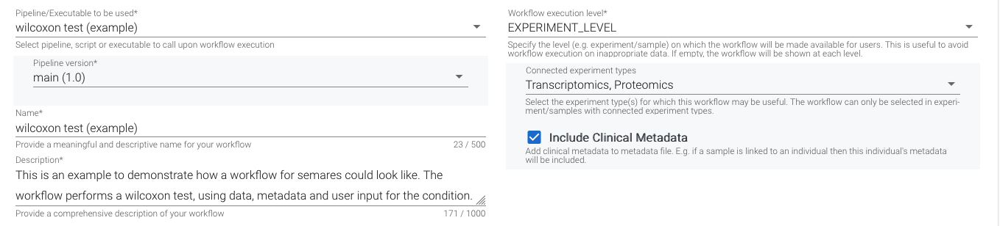
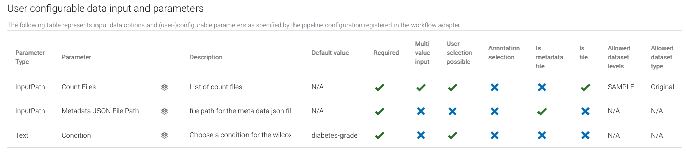
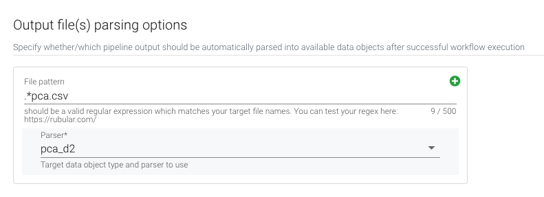
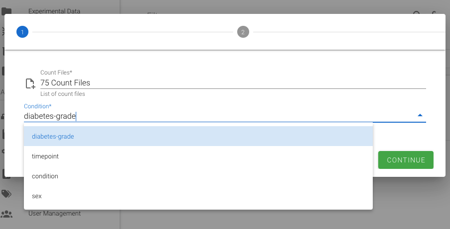

This is an example workflow to demonstrate how a workflow can be integrated in semares.

>If you run semares 1.5 or higher, you can automatically insert the workflow by including the example data. A link on the home screen is shown when you enter a empty semares system. Otherwise, navigate to `/tools/module_io?input_module=semares_example`

## Register the repository (semares >1.5)
Go to `Workflows->Repositories->New Repository`

### Fill the form
|Key|Value|
|------|------|
|**Repository**| mfricke-genevention/wilcoxon_rank_sum|
|**Description**| This is an example how a repository can be connected to semares. Check https://github.com/mfricke-genevention/wilcoxon_rank_sum.git to see how a repository based workflow could look like.|
|**Platform**| github|
|**Revision**| main|
|**Adapter**| Default Adapter (or other adapter if available)|

## Clone the repository (semares <1.5)
For older semares versions you need to clone the repository manually. Navigate to `/path/to/persistence/workflow_adapter/` and type `git clone https://github.com/mfricke-genevention/wilcoxon_rank_sum.git`.

Extend the `pipelines.yaml` file with the pipeline configuration which you can find here: [semares.yml](./semares.yml). Just copy the content of this file, starting at `line 2` to the end of `/path/to/persistence/workflow_adapter/pipelines.yaml`. `$PIPELINE_PATH` needs to be replaced by the full path of the pipeline folder in your system `/path/to/persistence/workflow_adapter/wilcoxon_rank_sum`. 

## Pipeline config file

The workflow parameter from at the frontend is based on the pipeline configuration. In this file the pipeline should be well described and all necessary parameters should be specified.

| Name | Description |
| ------ | ------ |
| **pipelineName** | unique pipeline name, used for pipeline identification in the system |
| **pipelineDescription** | pipeline free text description | 
| **pipelineVersion** | version string of pipeline; pipelines with same name should have different versions | 
| **pipelinePath** | path to pipeline execution file |
| **pipelineCommand** | command to start the pipeline |
|-|-|
| **pipelineParams** | list of pipeline parameters, which can be set in the semares platform |
| **paramName** | name of the parameter (free text) |
| **paramDescription** | description of the parameter (free text) |
| **paramKey** | parameter key to be passed to the pipeline |
| **paramType** | type of the parameter. Allowed values: `Text`, `Number`, `Boolean`, `OutputPath`, `InputPath` | 
| **isRequired** | may the pipeline be called with specification of this parameter value(`true`/`false`) |
| **isMultiValue** | if the parameter expects one or more values as input (`true`/`false`) |

Find a valid example here: [semares.yml](./semares.yml). You need to take care that the `semares.yml` follows the `yaml` syntax. This file will be the basis for the workflow registration at the frontend. 

## Register the workflow
Go to `Workflows->Workflows->New Workflow`\
Select adapter from above (Default Adapter)

Based on the select `Workflow execution` level and `Connected experiment types` the workflow will be shown to the user.

If a sample is linked to an individual, also the individual metadata can be send to the workflow - `Include Clinical Metadata`
> If the user does not have access to corresponding individual, the metadata will not be provided

#### Parameters
Set the workflow parameters as follows:

`Allowed dataset level` specifies where to find the input datasets. `Allowed dataset type` which kind of datasets types should be listed for the user.

#### Parser

If you wan't to visualize a file at the frontend. You need to specify a parser. After pipeline execution, all matching files will be transformed to data objects, which can be visualized in semares.

#### Resulting form for the user

The resulting form, based on the parameter specification.